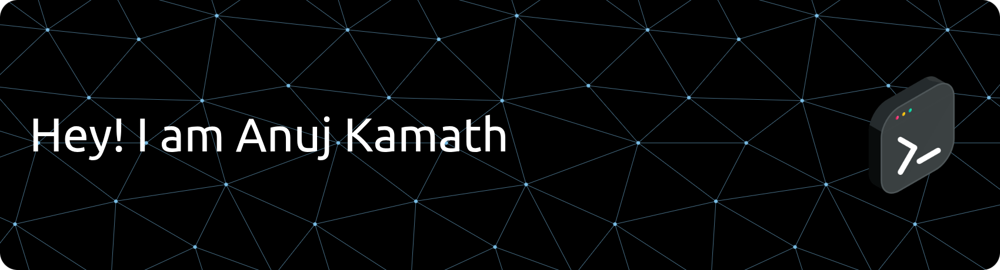

    

      
    

    

    
  

  

    
    
    
  

---

### Executive Overview
I am a **Computer Science & Engineering student (Honors)** at **MIT Manipal**, specializing in high-performance **NLP pipelines** and **speech processing**. As the **Former Chairperson of IECSE**, I led a 50+ member organization to execute premier technical initiatives, bridging the gap between hardware, software, and community leadership.

---

### The Engineering Bento

<table align="center" style="border-collapse: collapse; border: none;">
  <tr>
    <td width="50%" valign="top" style="border: 1px solid #29B40E; border-radius: 10px; padding: 15px;">
      <h4>🛠️ Tech Arsenal</h4>
        
      <b>Focus:</b> Attention Architectures, Feature Extraction, & Real-Time Systems.
    </td>
    <td width="50%" valign="top" style="border: 1px solid #29B40E; border-radius: 10px; padding: 15px;">
      <h4>Experience</h4>
      <b>SWE Intern @ Emper.ai</b> 
      <i>Node.js Backend & React Dashboards</i>   
      <b>Engineer Intern @ WiseStep</b> 
      <i>Microservices & SQL Optimization</i> 
    </td>
  </tr>
</table>

---

### Flagship Projects

| Project | Core Tech | Impact |
| :--- | :--- | :--- |
| **🎙️ Prosody S2S** | `PyTorch` `NLP` | [cite_start]Speech conversion preserving natural sentiment & prosody. |
| **🧠 Emotion Recognition** | `CNN-RNN` `MFCC` | [cite_start]Audio classification with **87% accuracy**. |
| **📄 Receipt OCR** | `OpenCV` `NER` | [cite_start]Structured data extraction with **40% accuracy boost**. |
| **👔 Hyrd ATS** | `MERN` `TF-IDF` | [cite_start]Smart job engine with optimized query performance. |

---

### Activity Dashboard

  

  
  

---

  🏆 <b>Branch Topper (2022-23)</b> | 🎓 <b>PwC Data Analytics & AI Certified</b> 
   
  
   
  <i>"Engineering software with precision, leading communities with purpose."</i>

